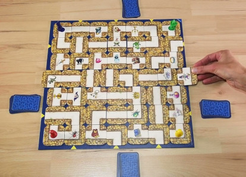

# Projet "Labyrinthe"



Application multi-joueur permettant de jouer au jeu de société du Labyrinthe, programmé en Java

## Technologies

- Java avec OpenJDK 23
- Java Swing pour l'interface graphique
- PUML pour un diagramme de classes de l'application

## Installation
### Pré-requis
- Avoir OpenJDK 21 ou 23 (17 pourrait peut-être marcher aussi)

### Téléchargement et compilation
``` Bash
# Copie du répertoire dans votre espace courant
git clone git@gitlab.unistra.fr:chanal-bowman/a31-labyrinthe
cd a31-labyrinthe
# Compilation
javac -d out -sourcepath src src/Main.java src/**/*.java
```

## Utilisation
### Lancement de l'application
``` Bash
# Lancement du programme (dans le même répertoire que la compilation)
java -cp out Main
```

### Déroulement de la partie
Vous devez commencer par placer la tuile en haut à droite de l'interface sur le plateau à la position de votre choix. Vous pouvez ensuite vous déplacer librement sur le plateau pour essayer de vous rapprocher de votre objectif, avant de finir votre tour.

Une fois tous vos trésors récupérés, retournez sur votre case départ pour remporter la partie.
